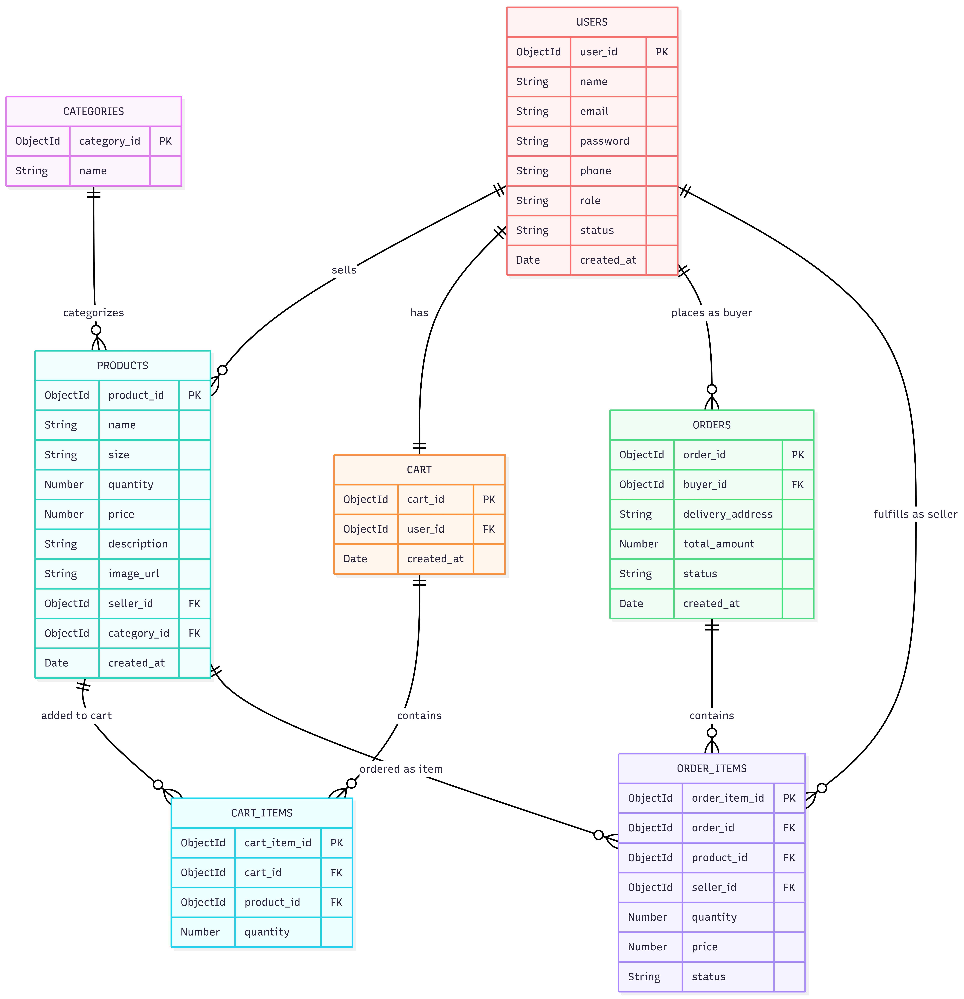
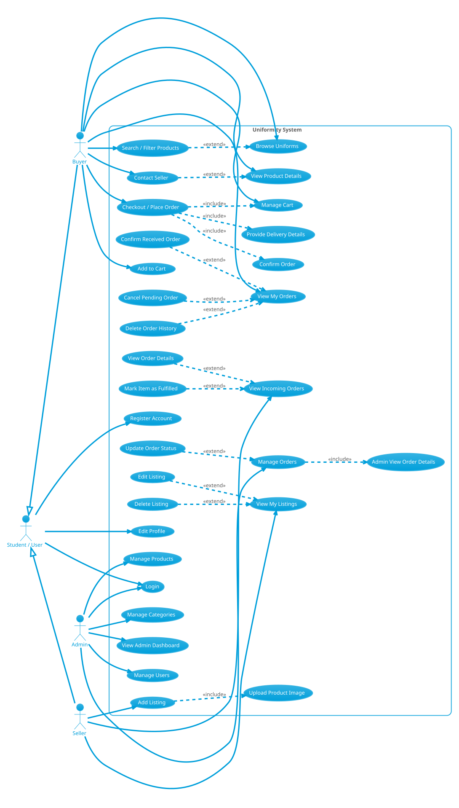

# Uniformity

<p align="center">
  
</p>

<h3 align="center">Uniformity: A Pre-Loved Uniform Marketplace</h3>

<p align="center">
  <em>Buy, sell, and manage school/professional uniforms in one simple full-stack web app.</em>
</p>

<hr/>

<p align="center">
  <a href="https://final-project-technic-bsit2a.onrender.com">
    
  </a>
  
</p>

<p align="center">
  
  
  
  
  
  
  
  
  
  
</p>

<hr/>

## 🌱 About the Project

Uniformity is a full-stack web marketplace for buying and selling pre-loved uniforms. The system helps students browse available uniforms, manage a cart, place orders, sell their own listings, and track fulfillment through a buyer-seller order flow.

The application is served as a single Render web service. The Express backend provides the REST API and also serves the static frontend files. A basic Progressive Web App layer is included so the app can be installed and can load cached pages when offline.

## ✨ Features

- 🔐 User registration, login, JWT authentication, and protected routes
- 👥 Student account flow that can act as both buyer and seller
- 🔎 Product browsing with search, category/size filters, sorting, and pagination
- 🧵 Product detail page with seller contact area, image preview overlay, and related products
- 🛒 Cart management with quantity controls, delete confirmation, stock-aware limits, and live badge count
- 📦 Checkout with saved name/phone fields and delivery details
- 🧾 Seller-aware order creation where items from different sellers become separate orders
- 📍 Buyer order history, order details, cancellation, receipt confirmation, and history deletion
- 🏷️ Seller listing management with add, edit, delete, and incoming order fulfillment
- 🚚 Seller order status flow from pending to fulfilled, then delivered after buyer receipt confirmation
- 🛠️ Admin dashboard for users, products, categories, and orders
- 📱 Responsive layouts for desktop, tablet, and mobile screens
- ⚡ PWA support with `manifest.json`, service worker caching, installability, and basic offline app-shell loading

## 🚀 Live Demo

Open the deployed project here:

[https://final-project-technic-bsit2a.onrender.com](https://final-project-technic-bsit2a.onrender.com)

## 🧰 Tech Stack

| Frontend | Backend | Database & Storage | Tools & Deployment |
|---|---|---|---|
| HTML5 | Node.js | MongoDB | Git & GitHub |
| CSS3 | Express.js | Mongoose | Render Web Service |
| Bootstrap 5 | JSON Web Token | Cloudinary | VS Code |
| Bootstrap Icons | bcryptjs |  | Chrome DevTools |
| Vanilla JavaScript | Multer |  |  |
| PWA Manifest & Service Worker | dotenv |  |  |

## ⚙️ Installation Instructions

### 1. Clone the Repository

```bash
git clone <repository-url>
cd final-project-TechNic-BSIT2a
```

### 2. Install Backend Dependencies

```bash
cd backend
npm install
```

### 3. Configure Environment Variables

Create a `.env` file inside `backend/`:

```env
PORT=5000
MONGO_URI=your_mongodb_connection_string
JWT_SECRET=your_jwt_secret
CLOUDINARY_CLOUD_NAME=your_cloudinary_cloud_name
CLOUDINARY_API_KEY=your_cloudinary_api_key
CLOUDINARY_API_SECRET=your_cloudinary_api_secret
```

### 4. Run the App Locally

```bash
npm run dev
```

Then open:

```text
http://localhost:5000
```

The backend serves the frontend from the `frontend/` folder, so the same local server handles both static pages and `/api` routes.

## 🗂️ Project Structure

```text
final-project-TechNic-BSIT2a/
|-- backend/
|   |-- config/
|   |-- controllers/
|   |-- middleware/
|   |-- models/
|   |-- routes/
|   `-- server.js
|-- database/
|-- docs/
|   |-- lab11/
|   `-- planning/
|-- frontend/
|   |-- css/
|   |-- img/
|   |-- js/
|   |-- manifest.json
|   |-- sw.js
|   `-- *.html
|-- .gitignore
`-- README.md
```

## 📸 Screenshots

### Landing Page


### Browse Uniforms


### Product Detail


### Cart


### Checkout


### My Orders


### My Listings


### My Profile


## 🧭 System Diagrams

### Data Flow Diagram

<p align="center">
  
</p>

### Entity Relationship Diagram

<p align="center">
  
</p>

### Unified Modeling Language Diagram

<p align="center">
  
</p>

## 👨‍💻 Contributors

| Name | Role |
|---|---|
| Mcxyron B. Cipriano | Back-End Developer |
| Jay L. Romano | Front-End Developer |
| Paul Orlando B. Red | Project Manager, Database Manager, GitHub Manager, Documentation Officer |
| Kurt Jushua S. Hernandez | Database Manager, Tester, Debugger |
| Mharie Franz Registrado | Tester, Debugger |

## 🎓 Group Information

**Group Name:** TechNic  
**Course & Block:** BSIT-2A  
**School:** Bicol University Polangui

## 📝 Notes

- `node_modules/` and `.env` are excluded through `.gitignore`.
- Runtime secrets should stay inside `backend/.env` and should not be committed.
- PWA files are intentionally kept in `frontend/` because that folder is served as the site root.
- Documentation assets are kept in `docs/` for lab reports, planning diagrams, and screenshots.
